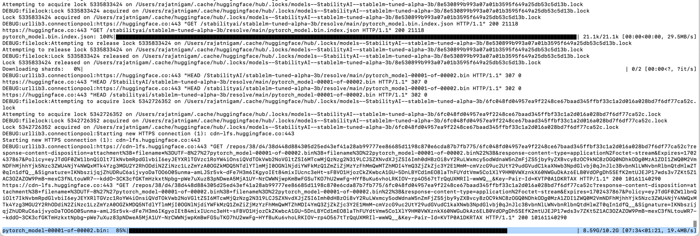
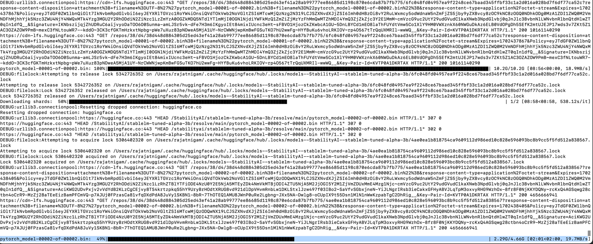
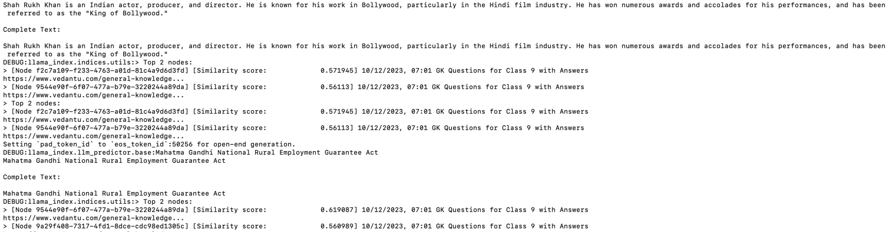

# LlamaIndex with HuggingFace

## Problem Statement
As GK Teacher of a school I want a LLM application to answer questions from class NCERT 9th GK books available in PDF format.  
Instead of a single question and answer, the LLM application must behave 
like a chatbot that can handle multiple back-and-forth queries and answers, getting clarification or 
answering follow-up questions.

## Business Requirements
- Due to budget constraints school authorities want in-house provisioning of LLM and Vector Index. They refrain to use SAAS tools like OpenAI or Pinecone vector stores. They can only spend one time on infrastructure for running LLMs on GPUs and hosting application on VMs. 
- Hence, the LLM must get hosted in on-prem setup. It must support Vector Indexing.
- For now, they want to pilot the application to get trained on GK subjects but the LLM must be scalable enough to get trained on other subjects like Mathematics, Chemistry, Physics etc. in the future.

## Technology Drivers
- LlamaIndex
  - LlamaIndex solves this problem by connecting to these data sources and adding your data to the data LLMs already have. This is often called Retrieval-Augmented Generation (RAG). RAG enables you to use LLMs to query your data, transform it, and generate new insights. You can ask questions about your data, create chatbots, build semi-autonomous agents, and more.
- Hugging Face
  - Hugging Face is a machine learning (ML) and data science platform and community that helps users build, deploy and train machine learning models. it's an open source data science and machine learning platform. It acts as a hub for AI experts and enthusiasts—like a GitHub for AI. The main features of Hugging Face is the ability to create your own AI models.
- Torch
  - The torch package contains data structures for multi-dimensional tensors and defines mathematical operations over these tensors. Additionally, it provides many utilities for efficient serialization of Tensors and arbitrary types, and other useful utilities.
- Python v3.11
  - the newest major release of the Python programming language, and it contains many new features and optimizations.
- Poetry
  - Poetry is a tool for dependency management and packaging in Python. It allows you to declare the libraries your project depends on and it will manage (install/update) them for you.

## Low level Requirements
- LLM Model: Writer/camel-5b-hf
  - The Camel-5b model is meticulously trained on an extensive dataset of approximately 70,000 instruction-response records. These records are generated by our dedicated Writer Linguist team, who possess considerable expertise in language modeling and fine-tuning techniques. By leveraging their skills and knowledge, the Camel-5b model is primed to offer unparalleled proficiency in understanding and executing language-based instructions.
- BAAI/bge-small-en-v1.5
  - FlagEmbedding model can map any text to a low-dimensional dense vector which can be used for tasks like retrieval, classification, clustering, or semantic search. And it also can be used in vector databases for LLMs.
  - `bge` is short for BAAI general embedding.

## Implementation
- Step 1
  - It starts with downloading LLM model from Hugging Face AI registry
  - Part 1  
    
  - Part 2
    
- Step 2
  - The 9th class GK book in PDF format is placed under `./data` location
  - Use `HuggingFaceLLM` to train LLM model with pdf files from local storage. This package internally use `Torch` plugin to train the LLM model in `.bin` extension. It will use RAG (Retrieval Augmentation Generation) to convert text to vectors using embeddings model.
  - The `Llamaindex` will use `pdf` packages to extract text from .pdf files and provide `StorageContext` to create bridge between `HuggingFaceLLM` and local storage.
- Step 3
  - Create a `ServiceContext` container which is a utility container for LlamaIndex index and query classes. The container contains the following objects that are commonly used for configuring every index and query, such as the LLM, the PromptHelper (for configuring input size/chunk size), the BaseEmbedding (for configuring the embedding model), and more.
  - Initialize `Llamaindex` query engine which is a generic interface that allows you to ask question over your data. A query engine takes in a natural language query, and returns a rich response. It is most often (but not always) built on one or many indexes via retrievers. You can compose multiple query engines to achieve more advanced capability.

## Execute QnA
- `poetry install`
- `poetry run llm`
  
## Result
- 